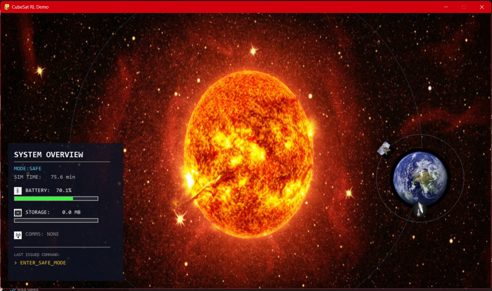
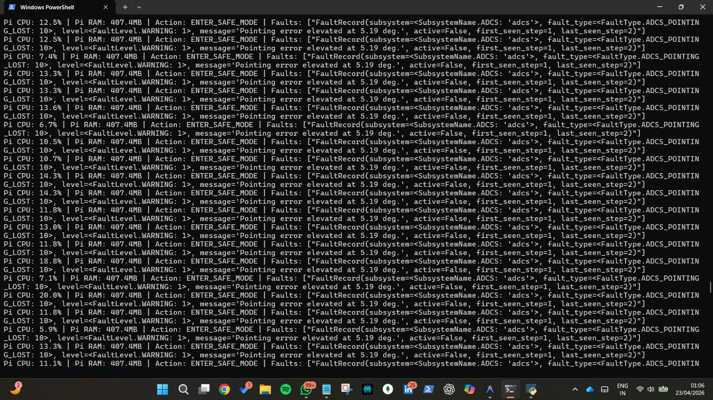
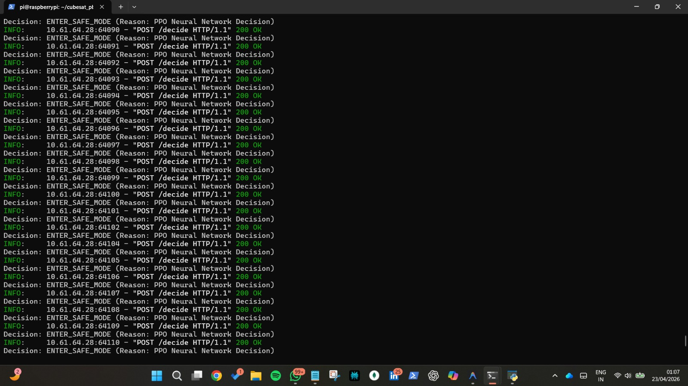

# CubeSat Reinforcement Learning Pipeline

## Overview
This project implements a complete Reinforcement Learning (RL) pipeline for autonomous CubeSat operations. The system simulates a CubeSat in orbit, handling telemetry, power management, attitude control, and subsystem faults. An RL agent (e.g., PPO, DQN) is trained to maintain satellite health and achieve mission objectives by making real-time decisions based on complex telemetry observations.

## Key Features
- **Custom Gymnasium Environment:** `CubeSatEnv` models realistic orbital dynamics, subsystem power draws, and telemetry generation.
- **Hardware-in-the-Loop Inference:** The trained models are optimized and deployed on memory-constrained hardware (e.g., Raspberry Pi) as an inference server.
- **Rich Visualization:** A `pygame`-based GUI provides a dynamic visual representation of the simulation, showing the satellite's orbit, sun position, and real-time telemetry.
- **Comprehensive RL Tooling:** Scripts for training (`train_dqn.py`, `train_baseline.py`), evaluating (`evaluate_policy.py`), and exporting policies.

## System Architecture

The core of the project relies on a closed-loop system:
1. **Observation:** The environment collects sensor data (battery, storage, comms, faults) and formats it into a dense observation vector.
2. **Decision:** The RL agent (or rule-based baseline) evaluates the state and outputs an optimal action.
3. **Action:** The environment processes the action (e.g., `ENTER_SAFE_MODE`, `TRANSMIT_DATA`), updating internal states and returning the next observation and a reward.

## Visualizing the System

### Simulation GUI
The main demonstration environment provides an interactive UI with vital telemetry. It allows tracking of the mission's status, mode, and resource levels.



### Agent Inference on Edge Hardware
The trained model can run on edge hardware (like a Raspberry Pi), making intelligent fault-recovery and operational decisions based on streamed telemetry.



### System Telemetry & Fault Monitoring
The host monitoring console tracks hardware usage, actions taken by the RL policy, and detailed subsystem fault states (e.g., ADCS pointing errors).



## Installation

Ensure you have Python 3.8+ installed. Install the required dependencies:

```bash
pip install -r requirements.txt
```

## Usage

### Running the Interactive Demo
To launch the interactive simulation with the Pygame visualization and a baseline policy:

```bash
python demo/run_demo.py
```


```

## Project Structure
- `env/`: Contains the core `CubeSatEnv` and logic for rewards, observations, and terminations.
- `demo/`: Contains the Pygame visualization and demo execution scripts.
- `scripts/`: Entry points for training, evaluating, and testing models.
- `models/`: Saved models and exported policies.
- `subsystems/`: Implementations of internal CubeSat subsystems (Power, Comms, ADCS, etc.).
- `data/`: Datasets for offline training or analysis.
